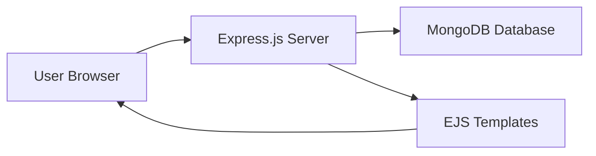
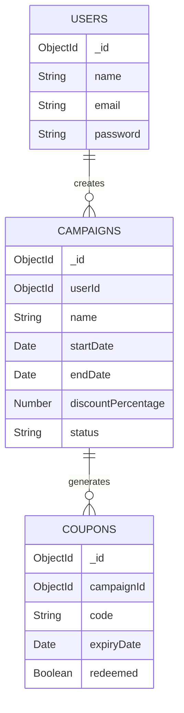

# Cover Page

**Project Name:** PromoPulse – Digital Coupon & Campaign Management Platform

**Student Name:** _____________________

**Course:** _____________________

**Submission Date:** _____________________

---

# Table of Contents
1. Introduction
2. Problem Statement
3. Objectives
4. Scope
5. Technologies Used
6. System Architecture
7. Database Design
8. Modules
9. Working Flow
10. Screenshots
11. Advantages
12. Limitations
13. Future Enhancements
14. Conclusion

---

## 1. Introduction
PromoPulse is a web-based application built to help businesses and shop owners manage their promotional campaigns. It allows them to create digital coupons that customers can use to get discounts. 

Nowadays, digital coupons are very important for businesses because they attract more customers and increase sales. People prefer digital codes over printed paper coupons because they are easy to save on their phones.

This application provides a simple interface where a business owner can log in, create a campaign, generate discount codes, and validate them when a customer uses them. It also shows a basic analytics page to see how many coupons were used.

## 2. Problem Statement
Many small businesses still use paper coupons or keep track of discounts manually on paper. This is hard to manage and takes a lot of time. Paper coupons can be lost easily, and they cost money to print.

Also, there is no easy way for small shop owners to track if a coupon was already used or if it has expired. They need a simple digital solution that does not require much technical knowledge to operate.

## 3. Objectives
- Build a web app for campaign management
- Allow coupon generation and validation
- Provide basic analytics
- Use modern web technologies
- Make it user-friendly

## 4. Scope
This project covers the core features needed for coupon management. It includes user authentication, managing marketing campaigns, generating random coupon codes, and viewing simple analytics. 

It does not cover payment integration, multi-language support, or a mobile app version. It is focused entirely on the business owner's perspective.

## 5. Technologies Used
- **Node.js**: Node.js lets us run JavaScript on the server side. It is fast and good for building web applications.
- **Express.js**: Express is a framework for Node.js that makes it easier to handle routes and requests.
- **MongoDB**: MongoDB is a database that stores data in a flexible format called documents instead of tables.
- **Mongoose**: Mongoose is a library that helps us connect to MongoDB and define the structure of our data.
- **EJS**: EJS is a template engine that lets us write HTML with dynamic data from the server.
- **Bootstrap 5**: Bootstrap is a CSS framework that helps us create nice-looking responsive web pages quickly.
- **Chart.js**: Chart.js is a JavaScript library that helps us create simple charts and graphs.
- **bcryptjs**: bcryptjs is a library used to encrypt passwords so they are stored safely in the database.

## 6. System Architecture
The application follows a simple client-server architecture. The user interacts with the browser, which sends requests to the Express server. The server talks to the MongoDB database to read or save data, and then sends back EJS HTML pages to the user.



## 7. Database Design
The project uses three main collections in MongoDB: Users, Campaigns, and Coupons.
- **Users**: Stores the user's name, email, and encrypted password.
- **Campaigns**: Stores the campaign details like name, start date, end date, discount percentage, and status. It is linked to the User.
- **Coupons**: Stores the generated code, expiry date, and a boolean flag to check if it was redeemed. It is linked to the Campaign.



## 8. Modules
- **Login Module**: This module allows existing users to log into their accounts using their email and password. It checks if the credentials match the database.
- **Register Module**: This module lets new users create an account. It takes their name, email, and password, and saves them securely.
- **Dashboard Module**: This is the main page after login. It shows a quick summary of the user's data, like the total number of campaigns and coupons.
- **Campaign Module**: This module lets users create, edit, view, and delete marketing campaigns. They can set the discount amount and the start and end dates.
- **Coupon Module**: Here, users can generate multiple unique coupon codes for a specific campaign. It also has a feature to validate if a code is valid, used, or expired.
- **Analytics Module**: This module displays simple charts using Chart.js to help users understand how many coupons were generated versus how many were actually used.

## 9. Working Flow
```
User opens the website
↓
User registers or logs in
↓
User creates a campaign
↓
User generates coupons for the campaign
↓
Coupons are shared with customers
↓
Customer enters coupon code to redeem
↓
System validates and marks coupon as redeemed
↓
Analytics page shows updated stats
```

## 10. Screenshots
Screenshots will be added after deployment.
- Home Page
- Register Page
- Login Page
- Dashboard Page
- Campaigns Page
- Coupons Page
- Analytics Page

## 11. Advantages
- Easy to use
- No paper coupons needed
- Real-time tracking
- Works on any device (responsive)
- Simple analytics

## 12. Limitations
- Single user type (no admin/customer roles)
- No email notifications
- No payment integration
- Basic analytics only

## 13. Future Enhancements
- Add admin panel
- Email coupon codes to customers
- QR code for coupons
- Detailed analytics with date filters
- Mobile app version
- Export reports as PDF

## 14. Conclusion
In this project, we successfully built a web application that helps businesses manage their digital coupons. It solves the problem of tracking paper coupons and provides a very easy-to-use platform.

I learned a lot about full-stack web development using Node.js, Express, and MongoDB. I also learned how to use template engines like EJS and make things look nice with Bootstrap. In the future, this project can be extended to include an admin panel and email notifications to make it even more useful.
