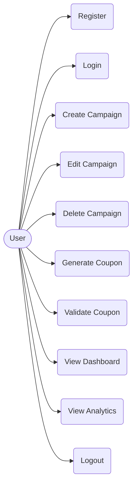
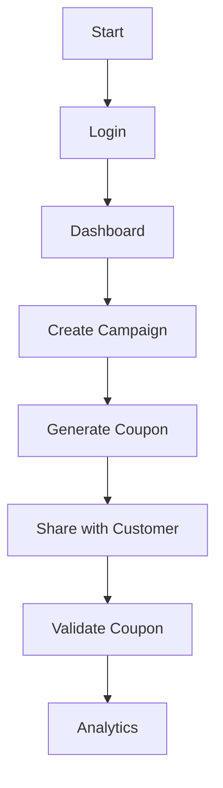

# PromoPulse - Extra Reference Material

## 1. Use Case Diagram



## 2. Flowchart



## 3. Folder Structure Diagram

```
PromoPulse/
├── config/
│   └── db.js
├── middleware/
│   └── auth.js
├── models/
│   ├── User.js
│   ├── Campaign.js
│   └── Coupon.js
├── routes/
│   ├── auth.js
│   ├── campaigns.js
│   └── coupons.js
├── public/
│   └── css/
│       └── style.css
├── views/
│   ├── navbar.ejs
│   ├── home.ejs
│   ├── login.ejs
│   ├── register.ejs
│   ├── dashboard.ejs
│   ├── campaigns.ejs
│   ├── campaign-form.ejs
│   ├── coupons.ejs
│   └── analytics.ejs
├── .env
├── app.js
├── package.json
└── README.md
```

## 4. API Route List

| Method | Route | Description |
|---|---|---|
| GET | / | Home page |
| GET | /auth/register | Show registration form |
| POST | /auth/register | Register new user |
| GET | /auth/login | Show login form |
| POST | /auth/login | Authenticate user |
| GET | /auth/logout | Logout user |
| GET | /dashboard | View user dashboard |
| GET | /campaigns | List all campaigns |
| GET | /campaigns/new | Show form to create campaign |
| POST | /campaigns | Create a new campaign |
| GET | /campaigns/:id/edit | Show form to edit campaign |
| POST | /campaigns/:id/edit | Update campaign details |
| POST | /campaigns/:id/delete | Delete a campaign |
| GET | /coupons | List all coupons and validation form |
| POST | /coupons/generate | Generate new coupons for a campaign |
| POST | /coupons/validate | Check and redeem a coupon |
| GET | /analytics | Show chart data |

## 5. MongoDB Collections

**Users Collection Example:**
```json
{
  "_id": "64f1b2c3a4d5e6f7a8b9c0d1",
  "name": "John Doe",
  "email": "john@example.com",
  "password": "$2a$10$abcdefghijklmnopqrstuvwxyz1234567890"
}
```

**Campaigns Collection Example:**
```json
{
  "_id": "64f1b2c3a4d5e6f7a8b9c0d2",
  "userId": "64f1b2c3a4d5e6f7a8b9c0d1",
  "name": "Summer Sale",
  "startDate": "2023-06-01T00:00:00Z",
  "endDate": "2023-08-31T23:59:59Z",
  "discountPercentage": 20,
  "status": "Active"
}
```

**Coupons Collection Example:**
```json
{
  "_id": "64f1b2c3a4d5e6f7a8b9c0d3",
  "campaignId": "64f1b2c3a4d5e6f7a8b9c0d2",
  "code": "SUMMER20-XY9K",
  "expiryDate": "2023-08-31T23:59:59Z",
  "redeemed": false
}
```

## 6. Sample Test Data
- **Users:**
  - Name: Alice Smith, Email: student1@test.com
  - Name: Bob Jones, Email: student2@test.com
- **Campaigns:**
  - Summer Sale (10% discount)
  - Student Discount (15% discount)
  - Festive Offer (20% discount)
- **Coupons:**
  - SAVE1234
  - PROMO5678
  - STUDENT15
  - FESTIVE20
  - SUMMER10

## 7. Installation Guide
**Prerequisites:** Node.js (v14+) and MongoDB installed on your system.

**Steps:**
1. Clone the project code to your local machine.
2. Open the terminal and go into the project folder.
3. Run `npm install` to download all the required packages.
4. Create a `.env` file and add your database link and port number.
5. Start the MongoDB service on your computer.
6. Run `npm start` to run the application.
7. Open a web browser and go to `http://localhost:3000` to see the app.

## 8. Common Errors & Solutions

| Error | Cause | Solution |
|---|---|---|
| MongoNetworkError | MongoDB not running | Start the MongoDB service on your computer. |
| EADDRINUSE | Port already in use | Change the port in the `.env` file or stop the other process. |
| Cannot find module | Package not installed | Run `npm install` in the terminal. |
| bcrypt error | Wrong bcrypt version | Use `bcryptjs` instead of `bcrypt` as it is easier to install on Windows. |
| Session not persisting | Missing secret key | Check the session configuration and add a secret key in `.env`. |
| CastError in MongoDB | Invalid ID format | Make sure you are passing a valid 24-character ObjectId. |
| Template not found | EJS view missing | Check if the file is inside the `views` folder and spelled correctly. |
| ReferenceError in EJS | Variable not passed to view | Make sure you are passing the data object in `res.render()`. |

## 9. Viva Questions with Answers

**1. What is Node.js?**
Node.js is an open-source platform that allows us to run JavaScript on the server. It is built on Chrome's V8 JavaScript engine.

**2. What is Express.js?**
Express.js is a web application framework for Node.js. It helps us build web applications and APIs easily by handling routing and middleware.

**3. What is MongoDB?**
MongoDB is a NoSQL database. It stores data in flexible JSON-like documents instead of using rows and columns like traditional databases.

**4. What is Mongoose?**
Mongoose is an Object Data Modeling (ODM) library for MongoDB and Node.js. It helps us create schemas to validate our data before saving it to the database.

**5. What is EJS?**
EJS stands for Embedded JavaScript. It is a templating engine that lets us inject dynamic data from our Node.js server into HTML pages.

**6. What is middleware?**
Middleware is a function that runs between the client's request and the server's response. We use it for things like checking if a user is logged in.

**7. How does authentication work in your project?**
We take the user's email and password. Then we hash the password and save it in the database. When they log in, we compare the passwords and create a session.

**8. What is bcrypt?**
Bcrypt is a library used to securely hash passwords. This means even if someone sees our database, they cannot know the actual passwords.

**9. What is a session?**
A session is a way to store data about a user across different pages. We use it to remember that a user is logged in as they navigate the app.

**10. How do you generate coupon codes?**
We use a function to create a random string of letters and numbers. We then save this random string to the database along with the campaign ID.

**11. What are the 3 checks in coupon validation?**
First, we check if the coupon code exists in the database. Second, we check if it has already been redeemed. Third, we check if the expiry date has passed.

**12. What is Chart.js?**
Chart.js is a JavaScript library for creating charts and graphs. We use it in our project to display the analytics for coupon usage.

**13. Explain your database design.**
We have three collections: Users, Campaigns, and Coupons. A User can create many Campaigns, and each Campaign can have many Coupons.

**14. What is CRUD?**
CRUD stands for Create, Read, Update, and Delete. These are the basic four functions we do when we interact with a database, like managing campaigns.

**15. What is Bootstrap?**
Bootstrap is a popular CSS framework. It gives us pre-built styles and components so we can quickly make our web pages look good and responsive.

**16. How is the password stored?**
The password is not stored in plain text. It is passed through a hashing algorithm using bcryptjs, and only the hash is saved in MongoDB.

**17. What is MVC?**
MVC stands for Model-View-Controller. It is a design pattern where Models handle data, Views show the UI, and Controllers manage the logic between them.

**18. What are the advantages of your project?**
It is easy to use and removes the need for physical paper coupons. It also provides real-time tracking so shop owners know exactly how many coupons are used.

**19. What are the limitations?**
It only supports one type of user, so there are no separate roles for admins and customers. It also does not have an email notification feature yet.

**20. How would you improve this project?**
I would like to add an admin panel to manage all users. I also want to add a feature to send the generated coupon codes directly to customers via email.

**21. What is REST API?**
A REST API is an architecture style for building web services. It uses standard HTTP methods like GET, POST, PUT, and DELETE to manage data.

**22. What is npm?**
npm stands for Node Package Manager. It is a tool used to install and manage third-party libraries and packages for Node.js projects.

**23. Explain the folder structure.**
The `models` folder has database schemas, `routes` has the URL paths, `views` has the EJS HTML files, and `public` has the CSS styling.

**24. What is .env file?**
The `.env` file is used to store secret variables like database passwords and port numbers. It is never uploaded to GitHub to keep our secrets safe.

**25. What is the difference between SQL and NoSQL?**
SQL databases store data in tables with strict schemas, like MySQL. NoSQL databases, like MongoDB, store data in flexible documents and are easier to scale.
